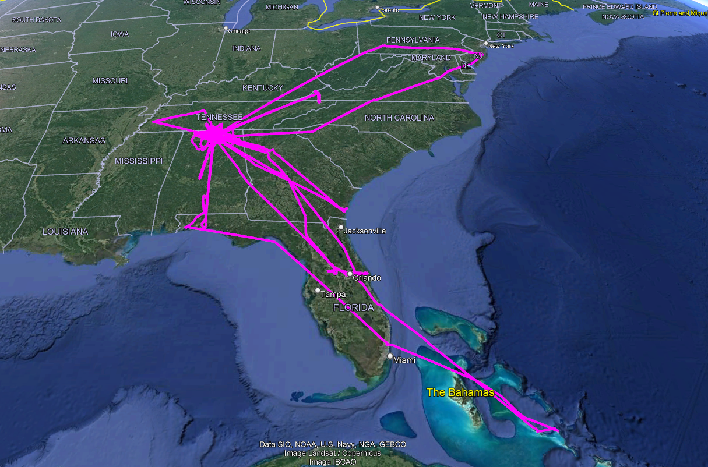

You can use this program currently to read a collection of g3x garmin logs and it will output a .kml file with all of the gps tracks overlaid in one place. 

You'll need to compile this program with golang like:
go build main.go

Then run it like:
./main -out output_filename.kml <log_file_1.csv> <log_file_2.csv> ...

It will produce a .kml file which can be read by google earth and looks like this:

